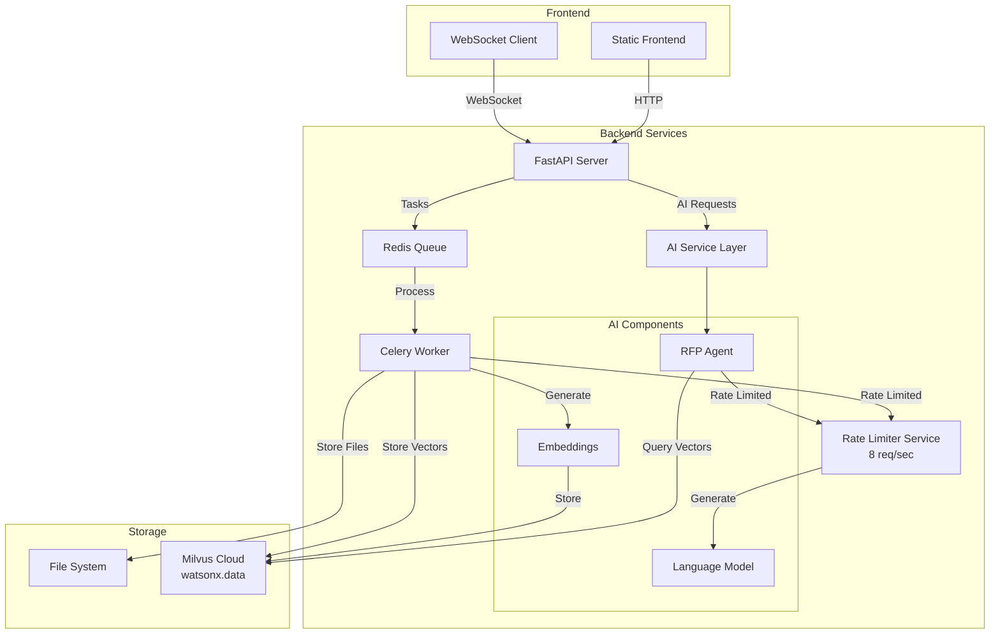

# AI-Powered RFP Analysis System

This application is an intelligent system for processing and analyzing Request for Proposal (RFP) documents. It converts PDF documents to markdown format and provides AI-powered analysis and interaction capabilities.

## Project Structure

- `backend/`: FastAPI backend with AI agents and document processing
  - `app/`: Main application code
    - `agents/`: AI agent implementations and factory
    - `api/`: API routes and endpoints
    - `core/`: Core functionality (Celery, WebSocket, settings)
    - `services/`: Business logic services
    - `tasks/`: Celery background tasks
    - `utils/`: Utility functions
  - `tests/`: Test suite
- `data/`: Data storage
  - `projects/`: Project-specific data and documents

## Setup Instructions

### Prerequisites

- Python 3.8+
- uv (for Python dependency management)
- Redis (for Celery task queue)
- Milvus cloud instance (watsonx.data or compatible)

### Backend Setup

1. Install uv if you haven't already:
   ```bash
   curl -LsSf https://astral.sh/uv/install.sh | sh
   ```

2. Install dependencies:
   ```bash
   cd backend
   uv sync
   ```

3. Create a `.env` file in the backend directory with your configuration:
   ```ini
   # Celery Configuration
   CELERY_BROKER_URL=redis://localhost:6379/0
   CELERY_RESULT_BACKEND=redis://localhost:6379/0
   # Unique queue name to avoid task conflicts between different workers
   # Each developer/deployment should use a different queue name
   # Examples: celery_julio, celery_mauricio, celery_production
   CELERY_QUEUE_NAME=celery_xyz
   
   # AI Configuration (WatsonX)
   WX_PROJECT_ID=your_project_id
   WX_API_KEY=your_api_key
   
   # Embedding Configuration
   EMBEDDING_MODEL=embedding_model_id
   EMBEDDING_DIMENSION=embedding_model_dimension
   # Tokenizer model should be compatible with selected embedding model and available on HF
   TOKENIZER_MODEL=available_embedding_model_id_hf
   
   # Milvus Cloud Configuration (watsonx.data)
   MILVUS_HOST=your_milvus_host
   MILVUS_PORT=your_milvus_port
   MILVUS_USER=your_milvus_user
   MILVUS_KEY=your_milvus_api_key
   ```

4. Start the Redis server (required for Celery):
   ```bash
   redis-server
   ```

5. Run the backend server (this automatically starts the Celery worker):
   ```bash
   cd backend
   uv run main.py
   ```
   
   The application will automatically start both the FastAPI server and the Celery worker.

### Logging Configuration

The application supports configurable logging modes to help with debugging and monitoring:

**Logging Modes:**
- `none` (default): Console-only logging, no log files created
- `all`: All logs written to files (app.log, errors.log, workflow.log, tasks.log)
- `errors`: Only error logs written to errors.log
- `workflows`: Only workflow logs written to workflow.log
- `tasks`: Only Celery task logs written to tasks.log

**Usage:**

Via command-line argument:
```bash
cd backend
uv run main.py --logging tasks
```

Via environment variable:
```bash
export LOGGING_MODE=tasks
cd backend
uv run main.py
```

**Log Files Location:**
When file logging is enabled, logs are written to `backend/logs/`:
- `app.log`: All application logs (DEBUG level)
- `errors.log`: Error logs only (ERROR level)
- `workflow.log`: Workflow-specific logs (DEBUG level)
- `tasks.log`: Celery task logs (INFO level)

**Examples:**
```bash
# Production mode (console only, no files)
uv run main.py

# Debug all components
uv run main.py --logging all

# Debug only workflows (hierarchical summarization)
uv run main.py --logging workflows

# Debug only Celery tasks (document processing, summarization)
uv run main.py --logging tasks

# Debug only errors
uv run main.py --logging errors
```

### Static Frontend

The application now uses a static frontend served directly by the FastAPI backend. No separate frontend setup is required. Access the application at `http://localhost:8000`.

## Usage

1. Open your browser and navigate to `http://localhost:8000`
2. Create a new project or select an existing one
3. Upload RFP documents (PDFs) to the project
4. The system will process the documents and provide AI-powered analysis
5. Interact with the AI agent to analyze and extract information from the documents

## API Endpoints

### Projects
- `POST /api/v1/projects`: Create a new project
- `GET /api/v1/projects`: List all projects
- `GET /api/v1/projects/{project_id}`: Get project details
- `DELETE /api/v1/projects/{project_id}`: Delete a specific project (including its Milvus collection and all data)
- `DELETE /api/v1/projects/reset`: Reset all data (delete all projects and collections)

### Documents
- `POST /api/v1/projects/{project_id}/documents/upload`: Upload a document to a project
- `GET /api/v1/projects/{project_id}/documents/{document_id}/status`: Get document processing status
- `GET /api/v1/projects/{project_id}/documents/{document_id}/markdown`: Get processed markdown content
- `GET /api/v1/projects/{project_id}/documents`: List all documents in a project
- `GET /api/v1/projects/{project_id}/documents/status`: Get status of all documents in a project

### Document Summarization
- `POST /api/v1/projects/{project_id}/documents/{document_id}/summarize`: Start document summarization
  - **Body Parameters:**
    - `summarization_type` (optional): `"executive"` (default, fast) or `"detailed"` (comprehensive)
    - `user_query` (optional): Natural language instructions for detailed summarization focus
      - Example: `"Focus on technical specifications and equipment requirements"`
      - Example: `"Highlight legal concerns and compliance requirements"`
      - Only applies to `"detailed"` type
- `GET /api/v1/projects/{project_id}/documents/{document_id}/summary`: Get document summary (supports multiple summary types)

### AI Interaction
- `POST /api/v1/chat`: Send a message to the AI agent
- `GET /api/v1/chat/stream`: Stream AI responses (Server-Sent Events)

### WebSocket
- `WebSocket /ws/{client_id}`: Real-time updates and notifications

## System Architecture



## Rate Limiting

The system implements centralized rate limiting to comply with WatsonX API limits (8 requests/second):

### Architecture
- **Centralized Service**: `backend/app/services/rate_limiter_service.py`
- **Implementation**: LangChain's `InMemoryRateLimiter`
- **Configuration**: 8 requests/second, max bucket size of 20 for burst capacity
- **Scope**: Shared across all AI operations (RFP Agent, Workflow LLM calls)

### Benefits
- ✅ Prevents 429 rate limit errors from WatsonX API
- ✅ Automatic request queuing and throttling
- ✅ Multi-user safe (shared rate limiter instance)
- ✅ Burst capacity for handling spikes in requests

### Usage
All LLM calls automatically use the centralized rate limiter:
```python
from app.services.rate_limiter_service import get_rate_limiter

# In LLM configuration
llm_config = {
    "model_id": "openai/gpt-oss-120b",
    "rate_limiter": get_rate_limiter(),  # Centralized rate limiter
    # ... other config
}
```

## Celery Queue Configuration

To prevent task conflicts when multiple workers share the same Redis broker, each developer/deployment should use a unique queue name:

### Configuration
Set the `CELERY_QUEUE_NAME` environment variable in your `.env` file:
```ini
# Examples:
CELERY_QUEUE_NAME=celery_julio        # For developer Julio
CELERY_QUEUE_NAME=celery_mauricio     # For developer Mauricio
CELERY_QUEUE_NAME=celery_production   # For production deployment
```

### Why This Matters
- **Problem**: Multiple workers on different machines can pick up each other's tasks
- **Solution**: Unique queue names ensure task isolation
- **Result**: Each worker only processes tasks from its own queue

### Default Behavior
If `CELERY_QUEUE_NAME` is not set, the default queue name `celery` is used.
```
