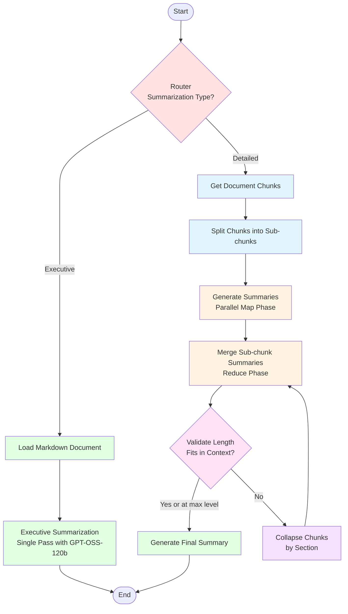

# Hierarchical Document Summarization Workflow

## Overview
This workflow provides **two types of document summarization** to meet different needs:

1. **Executive Summarization** (Default): Fast, high-level overview optimized for decision-makers
2. **Detailed Summarization**: Comprehensive hierarchical analysis using map-reduce with adaptive collapsing

## Architecture

### Workflow Flow



### Detailed Process

#### Executive Summarization Path (Fast)

1. **Router** (`route_summarization_type`)
   - Checks `summarization_type` in state
   - Routes to "executive" path if type is "executive"

2. **Load Markdown Document** (`load_markdown_document`)
   - Loads complete markdown file directly from file system
   - Bypasses vector DB for faster access
   - Returns full document content in state

3. **Generate Executive Summary** (`generate_executive_summary`)
   - Single-pass summarization using GPT-OSS-120b
   - Focuses on business/strategic aspects:
     - Main objectives and scope
     - Budget and financial considerations
     - Critical deadlines
     - Key risks and requirements
     - Evaluation criteria
   - Optimized for executive decision-making
   - Typical processing time: 5-15 seconds

#### Detailed Summarization Path (Comprehensive)

1. **Router** (`route_summarization_type`)
   - Routes to "detailed" path if type is "detailed"

2. **Get Document Chunks** (`get_chunks`)
   - Retrieves all document chunks from Qdrant vector database
   - Initializes collapse level to "none"
   - Each chunk becomes a `Chunk` object with empty sub-chunks

3. **Split Chunks** (`split_chunks`)
   - Splits each chunk into sub-chunks if it exceeds `SUMMARIZER_MAX_CONTEXT_LENGTH` (8192 tokens)
   - Uses tiktoken-based text splitter with no overlap
   - Preserves section structure from original chunks

4. **Generate Summaries** (`generate_summaries`) - **MAP PHASE**
   - Processes ALL sub-chunks concurrently using `asyncio.gather`
   - Uses smaller LLM (Granite 4H Small) for efficiency
   - Skips summarization for very short texts (<128 tokens)
   - Parallel execution significantly reduces processing time
   - **Optional user_query**: If provided, includes user instructions in every LLM call to focus the summarization

5. **Merge Summaries** (`merge_summaries`) - **REDUCE PHASE**
   - Merges sub-chunk summaries into chunk-level summaries
   - Processes all chunks concurrently
   - Uses reduce chain to combine multiple summaries coherently
   - **Optional user_query**: Applied to maintain focus throughout the reduction process

6. **Validate Length** (`validate_summaries_length`)
   - Checks if total summary tokens fit in `FINAL_SUMMARIZER_MAX_CONTEXT_LENGTH` (16384 tokens)
   - Routes to either:
     - **"finalize"**: Proceed to final summary generation
     - **"collapse"**: Merge chunks and retry

7. **Collapse Chunks** (`collapse_chunks`) - **ADAPTIVE COLLAPSING**
   - Hierarchical collapse strategy:
     - **Level 1 (none → subsection)**: Group by exact section (e.g., "1.1 DEFINICIONES")
     - **Level 2 (subsection → section)**: Group by main section (e.g., "1")
     - **Level 3 (section → ignore)**: Accept any length and proceed
   - Converts chunk summaries into sub-chunks for merged chunks
   - Routes back to `merge_summaries` to regenerate summaries
   - Prevents infinite loops with max collapse level

8. **Generate Final Summary** (`generate_final`)
   - Uses larger LLM (GPT OSS 120B) for higher quality
   - Combines all chunk summaries into coherent document summary
   - **Optional user_query**: Applied to final summary generation to ensure focus is maintained
   - Returns final summary in state
   - Typical processing time: 30-120 seconds

### State Schema

```python
class SubChunk(TypedDict):
    text: str                    # Original text content
    summary: Optional[str]       # Generated summary

class Chunk(TypedDict):
    text: str                    # Full chunk text
    summary: Optional[str]       # Aggregated summary of all sub-chunks
    sub_chunks: List[SubChunk]   # List of sub-chunks

SummarizationType = Literal["detailed", "executive"]
CollapseLevel = Literal["none", "subsection", "section", "ignore"]

class OverallState(TypedDict):
    project_id: str                      # Project identifier
    document_id: str                     # Document identifier
    summarization_type: SummarizationType # Type of summarization to perform
    user_query: Optional[str]            # Optional user instructions for detailed summarization
    chunks: List[Chunk]                  # Document chunks with summaries (detailed path)
    markdown_content: Optional[str]      # Full markdown content (executive path)
    final_summary: Optional[str]         # Final document summary
    error: Optional[str]                 # Error message if any
    collapse_level: CollapseLevel        # Current collapse level (detailed path)
```

### Key Components

- **graph.py**: LangGraph StateGraph definition with router and conditional routing for both paths
- **state.py**: TypedDict state schema (OverallState, Chunk, SubChunk, SummarizationType)
- **nodes.py**: Node function implementations with async processing for both paths
- **chains.py**: LangChain chains for map, reduce, final, and executive summarization
- **prompts.py**: LLM prompt templates in Spanish for RFP summarization (map, reduce, executive)
- **config.py**: Model configurations and context length limits
- **utils.py**: Markdown parsing utilities

### Features

✅ **Dual Summarization Modes**: Executive (fast) and Detailed (comprehensive)
✅ **Customizable Focus**: Optional user_query parameter for personalized detailed summaries
✅ **Handles Large Documents**: Processes documents beyond LLM context limits through chunking
✅ **Parallel Processing**: Concurrent summarization of all sub-chunks using asyncio
✅ **Centralized Rate Limiting**: LangChain InMemoryRateLimiter (8 req/sec) prevents API throttling
✅ **Adaptive Collapsing**: Hierarchical merging when summaries exceed context window
✅ **Multi-Tier LLM Strategy**: Fast SLM for map phase, powerful LLM for final/executive summaries
✅ **Vector DB Integration**: Retrieves pre-processed chunks from Milvus (detailed path)
✅ **Direct File Access**: Loads markdown directly for executive summarization (executive path)
✅ **Multiple Summaries Per Document**: Users can generate both executive and detailed summaries
✅ **Duplicate Request Prevention**: Backend validation rejects concurrent summarization requests
✅ **Comprehensive Logging**: Detailed workflow execution logs for debugging
✅ **Error Handling**: Graceful error handling with detailed error messages

### Configuration

**Model Configuration** (`config.py`):
- **Map/Reduce LLM** (Detailed path): `ibm/granite-4-h-small` (fast, efficient)
- **Final/Executive LLM**: `openai/gpt-oss-120b` (high quality)
- **Map Context**: 8192 tokens (2^13)
- **Final Context**: 16384 tokens (2^14)
- **Rate Limiter**: Centralized `InMemoryRateLimiter` (8 requests/second, max bucket size 20)

**Summarization Types**:
- **Executive** (default): Single-pass, business-focused, 5-15 seconds
- **Detailed**: Multi-pass hierarchical, comprehensive, 30-120 seconds

**Collapse Strategy** (Detailed path only):
- Level 1: Group by subsection (e.g., "1.1 DEFINICIONES")
- Level 2: Group by section (e.g., "1")
- Level 3: Accept any length

## Integration

### API Endpoints

**Start Summarization**:
```bash
POST /projects/{project_id}/documents/{document_id}/summarize
Content-Type: application/json

{
  "summarization_type": "executive",  // or "detailed"
  "user_query": "Focus on technical specifications and equipment requirements"  // Optional, only for detailed type
}
```

**User Query Examples** (for detailed summarization):
- `"Focus on technical specifications and equipment requirements"`
- `"Highlight legal concerns and compliance requirements"`
- `"Pay attention to budget constraints and financial terms"`
- `"Emphasize timeline, deadlines, and project milestones"`
- `"Extract information relevant to a technical team"`

**Get Summary Status**:
```bash
GET /projects/{project_id}/documents/{document_id}/summary
```

Returns:
```json
{
  "document_id": "doc_123",
  "project_id": "proj_456",
  "status": "completed",
  "summaries": [
    {
      "type": "executive",
      "summary": "...",
      "timestamp": "2024-01-15T10:30:00",
      "collapse_level": "none",
      "num_chunks": 0
    },
    {
      "type": "detailed",
      "summary": "...",
      "timestamp": "2024-01-15T10:35:00",
      "collapse_level": "subsection",
      "num_chunks": 15,
      "user_query": "Focus on technical specifications"
    }
  ]
}
```

### Celery Task

The workflow runs asynchronously via Celery task `summarize_document` in `backend/app/tasks/document_tasks.py`:

```python
from app.workflows.hierarchical_summarization.graph import summarization_workflow

# Execute workflow with summarization type and optional user query
final_state = await _run_workflow(
    summarization_workflow,
    {
        "project_id": project_id,
        "document_id": document_id,
        "summarization_type": summarization_type,  // "executive" or "detailed"
        "user_query": user_query,  // Optional, only applies to detailed type
        "chunks": [],
        "markdown_content": None,
        "final_summary": None,
        "error": None,
        "collapse_level": "none"
    }
)
```

### Status Tracking

Separate status fields for summarization:
- `summary_status`: "not_started" | "initializing" | "processing" | "completed" | "failed"
- `summary_progress`: 0-100 percentage
- `summary_error`: Error message if failed

**Duplicate Request Prevention**:
The API validates `summary_status` before accepting new summarization requests. If a summarization is already in progress (`"initializing"` or `"processing"`), the API returns HTTP 409 (Conflict) with a clear error message, preventing duplicate work and resource waste.

## Performance

### Executive Summarization
- **Single-Pass Processing**: No chunking or merging overhead
- **Direct File Access**: Bypasses vector DB for faster loading
- **High-Quality Model**: Uses GPT-OSS-120b for best results
- **Typical Processing Time**: 5-15 seconds regardless of document size
- **Best For**: Quick overviews, executive briefings, initial document assessment

### Detailed Summarization
- **Parallel Execution**: All sub-chunks summarized concurrently with rate limiting
- **Rate Limited Processing**: Centralized rate limiter ensures compliance with API limits (8 req/sec)
- **Adaptive Strategy**: Automatically adjusts to document size
- **Efficient Models**: Uses smaller model for bulk processing
- **Customizable Focus**: Optional user_query parameter to personalize the summary
- **Typical Processing Time**: 30-120 seconds depending on document size
- **Best For**: Comprehensive analysis, technical reviews, complete documentation, role-specific summaries

### Comparison

| Feature | Executive | Detailed |
|---------|-----------|----------|
| Speed | ⚡ Very Fast (5-15s) | 🐢 Slower (30-120s) |
| Detail Level | 📋 High-level overview | 📚 Comprehensive |
| Focus | 💼 Business/Strategic | 🔍 Technical/Complete |
| Document Size Handling | ✅ Any size | ✅ Any size (with collapsing) |
| Customization | ❌ Fixed format | ✅ Optional user_query for focus |
| Best Use Case | Quick decisions | In-depth analysis, role-specific reviews |

## Logging

Comprehensive logging to `backend/logs/workflow.log`:
- Node entry/exit with timing
- Chunk counts and token lengths
- LLM invocations and responses
- Collapse decisions and routing
- Error stack traces

## Error Handling

- Graceful handling of LLM failures
- Detailed error messages in state
- Retry logic in Celery task
- Status tracking for UI feedback